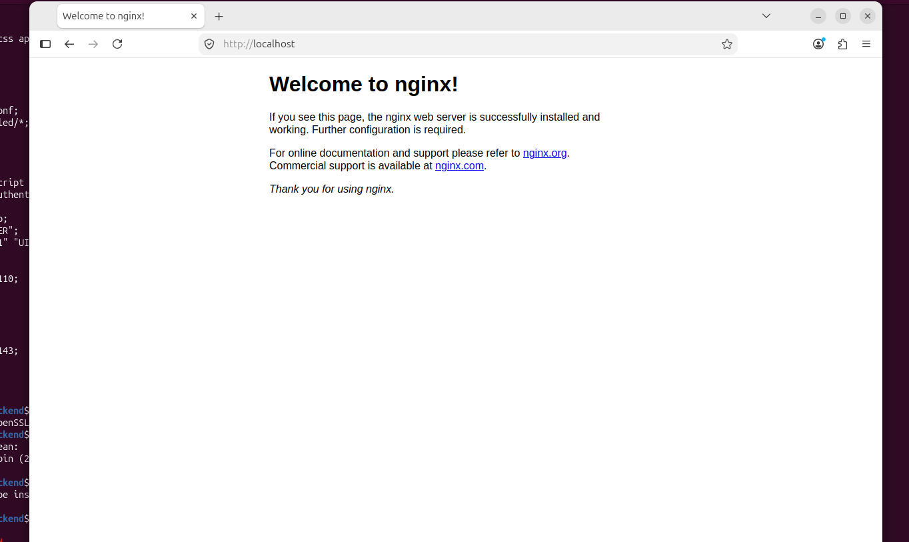
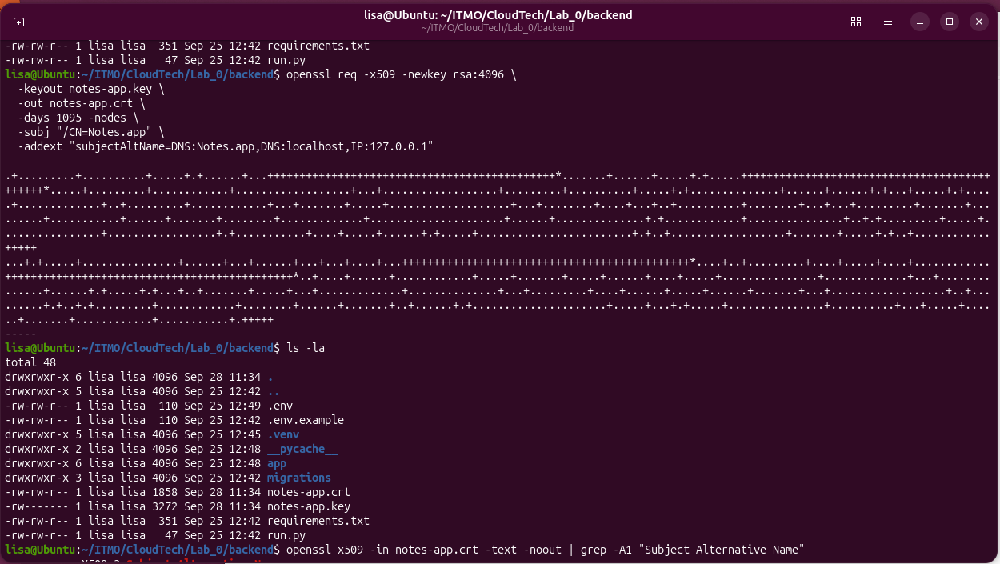

[Шпаргалка по разметке mark down](https://gist.github.com/OlgaMurzina/a094b7bfa6f15b25c683309885d68dbb#links)
# 📝 Лабораторная работа №1 (без *)
В этот раз, мы всей командой решили подготовить минисервер в виде виртуальной машины, чтобы не ставить вторую систему на ноутбук. С первого семестра у нас остался VirtualBox. Мы создали новую виртуальную машину и установили на нее ОС Ubuntu 26.04.   

# 🛠️ Как это было
## День 1-й. Ставим nginx и пробуем выпустить ssl-сертификат  
### Ставим nginx  
Первым делом установили nginx.
   ```bash
    sudo apt install nginx
   ```
После установки проверяем статус службы nginx:
   ```bash
    sudo service nginx status
   ```
Все хорошо, служба работает (вот за это мы и любим Ubuntu в частности, и Linux в целом):
   ```text
● nginx.service - A high performance web server and a reverse proxy server
     Loaded: loaded (/usr/lib/systemd/system/nginx.service; enabled; preset: enabled)
     Active: active (running) since Mon 2026-09-28 10:30:50 UTC; 17s ago
 Invocation: 2918cc0afb4940d9ac9a5727991a90a5
       Docs: man:nginx(8)
    Process: 7691 ExecStartPre=/usr/sbin/nginx -t -q -g daemon on; master_process on; (code=exited, status=0/SUCCESS)
    Process: 7693 ExecStart=/usr/sbin/nginx -g daemon on; master_process on; (code=exited, status=0/SUCCESS)
   Main PID: 7728 (nginx)
      Tasks: 9 (limit: 6353)
     Memory: 7.3M (peak: 16.5M)
        CPU: 54ms
     CGroup: /system.slice/nginx.service
             ├─7728 "nginx: master process /usr/sbin/nginx -g daemon on; master_process on;"
             ├─7731 "nginx: worker process"
             ├─7732 "nginx: worker process"
             ├─7733 "nginx: worker process"
             ├─7734 "nginx: worker process"
             ├─7735 "nginx: worker process"
             ├─7736 "nginx: worker process"
             ├─7737 "nginx: worker process"
             └─7738 "nginx: worker process"

Sep 28 10:30:50 Ubuntu systemd[1]: Starting nginx.service - A high performance web server and a reverse proxy server...
Sep 28 10:30:50 Ubuntu systemd[1]: Started nginx.service - A high performance web server and a reverse proxy server.
   ```
   Посмотрим что находится в файле настроек nginx:
   ```bash
    cat /etc/nginx/nginx.conf
   ```
<details>
  <summary>Видим содержимое файла /etc/nginx/nginx.conf</summary>

   ```text
        user www-data;
        worker_processes auto;
        worker_cpu_affinity auto;
        pid /run/nginx.pid;
        error_log /var/log/nginx/error.log;
        include /etc/nginx/modules-enabled/*.conf;
        
        events {
            worker_connections 768;
            # multi_accept on;
        }
        
        http {
        
            ##
            # Basic Settings
            ##
        
            sendfile on;
            tcp_nopush on;
            types_hash_max_size 2048;
            server_tokens build; # Recommended practice is to turn this off
        
            # server_names_hash_bucket_size 64;
            # server_name_in_redirect off;
        
            include /etc/nginx/mime.types;
            default_type application/octet-stream;
        
            ##
            # SSL Settings
            ##
        
            ssl_protocols TLSv1.2 TLSv1.3; # Dropping SSLv3 (POODLE), TLS 1.0, 1.1
            ssl_prefer_server_ciphers off; # Don't force server cipher order.
        
            ##
            # Logging Settings
            ##
        
            access_log /var/log/nginx/access.log;
        
            ##
            # Gzip Settings
            ##
        
            gzip on;
        
            # gzip_vary on;
            # gzip_proxied any;
            # gzip_comp_level 6;
            # gzip_buffers 16 8k;
            # gzip_http_version 1.1;
            # gzip_types text/plain text/css application/json application/javascript text/xml application/xml application/xml+rss text/javascript;
        
            ##
            # Virtual Host Configs
            ##
        
            include /etc/nginx/conf.d/*.conf;
            include /etc/nginx/sites-enabled/*;
        }
        
        
        #mail {
        #	# See sample authentication script at:
        #	# http://wiki.nginx.org/ImapAuthenticateWithApachePhpScript
        #
        #	# auth_http localhost/auth.php;
        #	# pop3_capabilities "TOP" "USER";
        #	# imap_capabilities "IMAP4rev1" "UIDPLUS";
        #
        #	server {
        #		listen     localhost:110;
        #		protocol   pop3;
        #		proxy      on;
        #	}
        #
        #	server {
        #		listen     localhost:143;
        #		protocol   imap;
        #		proxy      on;
        #	}
        #}
   ```
</details>
<details>
  <summary>Пробуем посмотреть что выдаст браузер по этому url: http://localhost/</summary>



</details>

### Выпускаем самоподписной ssl-сертификат
Пробуем выпустить самоподписной ssl-сертификат для локальных имен: Notes.app, locallhost и локального ip 127.0.0.1:
   ```bash
    openssl req -x509 -newkey rsa:4096 \
      -keyout notes-app.key \
      -out notes-app.crt \
      -days 1095 -nodes \
      -subj "/CN=Notes.app" \
      -addext "subjectAltName=DNS:Notes.app,DNS:localhost,IP:127.0.0.1"   
  ```
В итоге получили 2 файла:
1. notes-app.key
2. notes-app.crt

<details>
  <summary>Это скриншот создания самоподписного ssl-сертификата"</summary>



</details>

### Подключаем самоподписной ssl-сертификат к nginx
Положили файл notes-app.key в каталог /etc/ssl/private/:
   ```bash
    sudo mv notes-app.key /etc/ssl/private/notes-app.key 
  ```
Положили файл notes-app.crt в каталог /etc/ssl/certs/:
   ```bash
    sudo mv notes-app.crt /etc/ssl/certs/notes-app.crt 
  ```
Создали файл настройки нашего сервиса:
   ```bash
    sudo nano /etc/nginx/sites-enabled/notes-app 
  ```


## День 2-й. Backend начало
